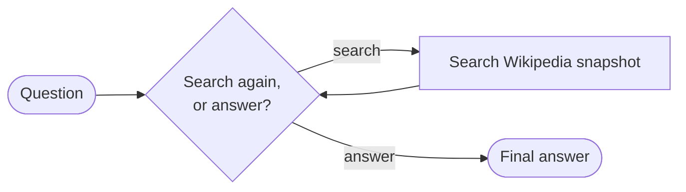
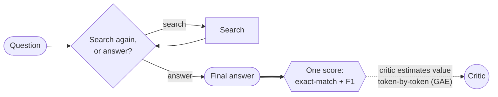
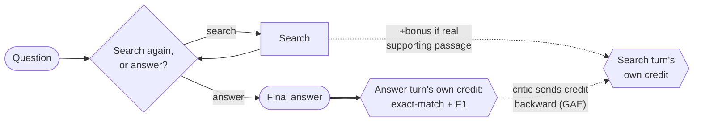

# Outcome vs. Turn-Level Reward for Multi-Turn Search Agents

**Goal**: determine whether rewarding an AI agent's intermediate actions, not just its final
answer, produces a measurably better multi-turn search agent.

**Why this matters.** RL algorithms like GRPO and PPO are the standard way to train multi-turn LLM
agents, but they're usually trained on sparse outcome rewards: one number, right or wrong, at the
very end of a long trajectory. That gives the agent no signal about which of its intermediate
actions (like a good search) actually helped. The paper this repo is inspired by found that adding
a dense, turn-level reward signal on top of the same algorithms fixes that: more stable training,
faster convergence, and higher accuracy than sparse-reward baselines. This repo tests whether that
holds up at a much smaller scale.

Inspired by ["Reinforcing Multi-Turn Reasoning in LLM Agents via Turn-Level Reward
Design"](https://arxiv.org/abs/2505.11821) (arXiv:2505.11821), specifically its GRPO and PPO case
study, though not a strict reproduction. Biggest differences: a much smaller model on a single consumer GPU
(`Qwen3.5-0.8B` on an RTX 4090, vs. the paper's `Qwen2.5-7B`) and a different dataset (HotpotQA
vs. TriviaQA, picked for genuinely multi-hop questions). Smaller deviations are noted inline below.

## The agent

This repo's agent answers a question by deciding, at each turn, whether to search a Wikipedia
snapshot (a fixed, offline copy, not the live site) for more information or give a final answer.
Different rollouts of the same question can end up searching a different number of times.
Every condition below trains that identical agent and decision loop; only the reward function
changes, so any difference in results comes from the reward design, not the architecture.




## Reward approaches explored

GRPO's baseline design can't use an intermediate signal even if you hand it one. It computes one
advantage per trajectory (Eq. 4 in the paper) and applies that identical value to every token in
every turn. A sharp search followed by a garbled answer, and a lazy search followed by a lucky
guess, get scored no differently turn-by-turn. GRPO simply can't isolate which turn actually
earned the credit.

That holds no matter where in the trajectory you attach a bonus reward. GRPO only ever sees one
number per trajectory, so a bonus placed mid-episode still gets folded into that same number by
the time training sees it. Actually using where a reward happened requires a critic that can
evaluate any point in a trajectory on its own. PPO has one; GRPO doesn't. That's why the last two
approaches below switch algorithms instead of just rearranging the reward within GRPO.

This repo compares four ways to address it, in increasing order of how directly they solve it:

- **`GRPO-OR`: outcome only.** Reward = final-answer correctness, nothing else. Simplest
baseline; search behavior gets no direct training signal at all. **Implemented**
- **`GRPO-MR`: merged reward** (the paper's own term for this approach is "naive"). Adds a bonus
for good search behavior, but folds it into the *same* one trajectory-level number GRPO already
scores. Denser reward, but the advantage is still spread uniformly across every token; GRPO still
can't tell which turn helped. **Implemented**
- **`PPO-OR`: the same outcome-only reward as `GRPO-OR`, scored by a critic instead.** Same
reward, different algorithm: no group comparison, just a learned value function estimating
expected return. This repo's baseline for the comparison below. **Coming soon**
- **`MT-PPO`: turn-level reward with a critic, not extra rollouts.** Same setup as `PPO-OR`, but
adds a bonus for good search behavior and places it at the turn it was earned instead of dumping
it at the end. PPO's critic already estimates value token-by-token (GAE), so credit flows
backward through the trajectory automatically. No exponential rollout cost, no fixed-turn
requirement. The paper's best-performing method. **Coming soon**


### Outcome Only Reward (GRPO-OR)


### Merged Reward (GRPO-MR)


The search bonus checks whether the search turned up one of the specific Wikipedia articles a
person identified as necessary to answer the question, separate from whether the final answer
turns out right or wrong, which is still scored the normal way (exact-match + F1).


### Outcome Only Reward, with a Critic (PPO-OR) - **Coming Soon**




### Turn-Level Credit Assignment (MT-PPO) - **Coming Soon**




## GRPO Results (PPO coming soon)

### What's being measured

Both reward approaches above (outcome-only reward `GRPO-OR` and merged reward `GRPO-MR`)
were trained on HotpotQA, a Wikipedia-based question-answering dataset built so that most
questions genuinely require two hops of evidence, not one.

> **Q:** What county is home to the restaurant Red's Eats?
>
> **Search 1:** `Red's Eats` → surfaces the restaurant's own Wikipedia article: it's located in
> Wiscasset, Maine.
>
> **Search 2:** `Wiscasset, Maine, county` → nothing told the agent to search this. It had to
> notice "Wiscasset" in the first search's results and decide, on its own, to look that up next.
> Surfaces the article naming the county.
>
> **Answer:** Lincoln County (correct).

Two searches, the second one chosen because of what the first one returned, landing on the right
answer. This is exactly the two-hop behavior `retrieval_fraction` (below) is designed to measure.
Both conditions were evaluated on a 7,404-question
held-out test set neither one ever trained on, using three metrics that track different things:
two for whether the answer was right, one for whether the search behavior itself was good, since
testing whether rewarding search helps means measuring both sides of that claim.

- **Exact match (EM)**: did the agent's final answer literally match an accepted answer string?
Predicting "Lincoln County" matches. Predicting "Lincoln" does not, even though it's basically
right.
- **F1**: the standard SQuAD-style score QA benchmarks use, the harmonic mean of word-level
precision and recall between the predicted and gold answer. That same "Lincoln" prediction gets
partial credit here, instead of the zero EM gives it, since it's incomplete rather than wrong.
- **Retrieval fraction**: of the real supporting-fact passages actually needed to answer the
question, what fraction did the agent's searches surface? In the example above, that's 1.0 (both
the Red's Eats and Wiscasset articles got found). Finding only one of the two would score 0.5.
Only tracked for merged reward, since
that's the only condition whose reward depends on it.


### Sparse reward doesn't reward the process, only the outcome

GRPO can't isolate which turn earned the credit. It scores a whole trajectory with one number, so
if that number never reflects how well the agent searched, there's nothing keeping good search
behavior alive once training pressure pushes the model toward just answering.

For example: one rollout searches well, finds the right supporting article, but still gets the
final answer wrong (reward: 0). Another skips searching entirely and answers correctly anyway,
using knowledge already baked in from pretraining rather than anything found this episode
(reward: 1). Outcome-only reward gives full credit to the guess and zero credit to the good
search, even though the search is the behavior we actually want to encourage. Ideally both would
get credit, just for different things: the first for its good search, the second for its correct
answer, scored independently. That's exactly what turn-level reward adds, and what outcome-only
reward can't do.

### 1. Merged reward (`GRPO-MR`) outperforms outcome-only reward (`GRPO-OR`)


| Metric (held-out)  | `GRPO-OR` / outcome reward | `GRPO-MR` / merged reward |
| ------------------ | -------------------------- | ------------------------- |
| Exact match        | 0.242                      | **0.307**                 |
| F1                 | 0.343                      | **0.399**                 |
| Retrieval fraction | n/a                        | 0.528                     |


That 0.065 exact-match gap is real, not run-to-run noise: a two-proportion significance test on
the ~7,400 held-out questions puts it at p < 1e-18 (z ≈ 8.8), with a 95% confidence interval of
roughly [0.050, 0.079], comfortably clear of zero. (This treats the two conditions as
independent samples, since per-question correctness isn't stored separately for each condition.
The true paired test, scoring both models on the exact same questions, would likely show even
tighter significance.)

`retrieval_fraction` is the clearest direct evidence that the mechanism above is actually
working: it's merged reward visibly keeping "search well" alive as a trained behavior, instead of
letting it atrophy the way outcome-only reward has no reason not to. `GRPO-OR` has no
retrieval_fraction to compare against, since its reward never looks at search quality, so the only
meaningful comparison for `GRPO-MR`'s retrieval_fraction is against itself over time. It climbed
steadily over training, closing in on the corpus's own ~80% ceiling (about 20% of HotpotQA's gold
passage titles simply aren't in this repo's Wikipedia snapshot, so even perfect retrieval can't
reach 1.0):


<details>
<summary>Aside (open question): outcome-only reward's agent searches more over training, not less</summary>

Under outcome-only reward, this agent's search-call frequency actually rose over training rather
than falling, which is surprising, since nothing in that reward rewards extra searching. We don't
have a confirmed explanation for this. It doesn't change the headline comparison above (`GRPO-MR`
still wins on both EM and F1). It's a real, unexplained pattern worth flagging honestly rather
than smoothing over.


</details>


<details>
<summary>Why did this need a second run, and why is that not just seed-shopping?</summary>

Before ever launching a training run, four objective checks were written down for deciding
whether a result could just be noise: is the gap between conditions smaller than the run's own
step-to-step swings; does the held-out result contradict the training-time trend; does the
paper's claimed search-frequency mechanism actually show up; does retrieval_fraction keep
declining instead of stabilizing. These were fixed in advance, not chosen after seeing a result
that didn't look right.

The first run (300 steps, 150 distinct training prompts) tripped 3 of the 4. The most damning:
merged reward led throughout training, but held-out data flipped it entirely: `GRPO-OR` ahead,
0.2355 vs. 0.2068 EM. That's a real, quantified reliability failure, not a hunch.

The fix was **one** pre-planned replication at double the training data (300 distinct prompts
instead of 150), run identically for both conditions, not several seeds tried until one gave
the preferred answer. A new seed was necessary only because re-running the same seed on this
deterministic pipeline reproduces the same run, not an independent data point; the actual fix is
the added training data, not the seed itself.


The replication resolved cleanly: merged reward now leads on both training and held-out data
(the curves above), and re-checking all four criteria against the new numbers, only one still
triggers: the search-call-frequency anomaly already shown above (`GRPO-OR` searching more, not
less, over training).
(Curves are a 15-point rolling average of per-step training metrics; the raw values are noisy
step-to-step, as GRPO reward inherently is. Smoothing is only for readability, not a different
underlying result.)
</details>


### 2. The same failure mode strikes again, under a manufactured penalty

Section 1 showed sparse reward is fragile because nothing keeps "search well" alive under
pressure. That raised a follow-up question: how far does merged reward's protection actually
extend? So we manufactured three more kinds of pressure and stress-tested both conditions
against them: three ad-hoc, uncalibrated attempts to improve on the baseline above
(0.242 / 0.307 EM), each tried in one session. (These are single runs with no significance test,
unlike Finding 1's, but a formal test would be theater here: the effect sizes below are 3-10x
collapses, not the kind of gap that a plausible amount of run-to-run noise could produce.)

**None worked.** But *how* they failed is the same lesson as Section 1, playing out a second
way: this is **reward hacking** (also called specification gaming, or Goodhart's law in its
classic form: "when a measure becomes a target, it ceases to be a good measure"), this time
triggered by an added penalty instead of a missing bonus.


- **Length penalty** (not from the paper; completions had grown 4x with no accuracy gain).
Outcome reward **collapsed to 0.090 EM**, garbled text. Merged reward dropped to 0.254 EM,
stayed coherent.
- **The paper's own PPO search-count penalty** (`R_search = -λ_s·n_search`, borrowed into GRPO,
though the GRPO ablation has no such term). Outcome reward **collapsed to 0.024 EM**, nonsense
answers. Merged reward dropped to 0.221 EM: it collapsed too, then *recovered* late in training.
- **Isolating control**: same prompt-guidance removal, *no* penalty. Outcome reward only dropped
to 0.201 EM (searched *more*, not less). Merged reward rose to 0.320 EM. No cost. This
pins the two collapses above on the penalty term itself, not the missing guidance.

**Why**: GRPO scores a group of attempts purely relative to each other, with no value function to
fall back on. If every attempt in a group finds the same cheap trick (stop searching, just guess)
instead of doing what the reward actually intended, GRPO can't see past it: the whole group looks
equally bad, so there's no gradient telling it that's wrong. Merged reward's extra signal gave the
model something to hold onto instead; outcome reward's plainer signal didn't.

**Takeaway**: a bare penalty with no matching positive incentive is genuinely risky under GRPO,
more so than under an algorithm with a value function to catch a group sharing one mistake.

### Key learnings

1. Merged reward (`GRPO-MR`) outperforms outcome-only reward (`GRPO-OR`) on our held-out test
  set, by a gap too large to be run-to-run noise (Result 1).
2. Both results trace back to one mechanism: GRPO gives a whole group of attempts a single,
  shared, relative score, so any behavior the reward doesn't track has nothing keeping it in
   check. Outcome-only reward lets good searching atrophy, and an added penalty lets both
   conditions collapse toward "just stop searching." Merged reward's extra signal is real, but
   incomplete, protection against that failure mode (Result 2).


## Roadmap

- **GRPO: outcome-only vs. merged-reward.** Training and held-out evaluation complete for both
conditions across two runs; the symmetric re-run shows a real, held-out-confirmed advantage for
merged reward (see Results above). Three follow-up reward-design experiments are complete
(see Results above); Phase 6 is fully done.
- **PPO: outcome-only vs. merged-reward.** Design complete; not yet started.
- **LLM-as-judge reward.** The paper studies two kinds of turn-level reward: *verifiable* (this
repo's `turn_reward`, an objective check on whether a real supporting passage got surfaced) and
*LLM-as-judge* (a model scores the turn instead). The judge variant, explored on top of the PPO
comparison, is not yet started.


## Project structure

```
.
├── data/       # downloaded wiki-18 retrieval corpus + BM25 index (gitignored, multi-GB)
├── docs/       # phase docs, design specs, roadmap
├── outputs/    # training checkpoints + logs per condition (gitignored)
├── results/    # final held-out metrics + comparison plots (committed)
├── scripts/    # retrieval server, one-off setup/verification, compare_runs.py
├── src/        # the turn_level_rewards package (env, rewards, metrics, data, train, evaluate)
└── tests/      # unit tests (fast, no GPU, no live retrieval server)
```


## Getting started


### Prerequisites

- Python 3.13+
- `[uv](https://docs.astral.sh/uv/)`
- JDK 21 (needed by the retrieval server's Lucene bridge)

Two choices worth knowing before you set up: the model is a deliberately small `Qwen3.5-0.8B`
(fits one GPU, no distributed training), and retrieval hits a real ~21M-passage Wikipedia
snapshot rather than a small per-question pool (a closed pool would make retrieval trivially
easy to solve, not a real test).

```bash
uv sync
sudo apt install openjdk-21-jdk
```


### Retrieval server

Training and evaluation search a local BM25 server backed by the real wiki-18
Wikipedia dump (~21M passages). Set it up once:

```bash
bash scripts/setup_retrieval.sh   # downloads the wiki-18 BM25 index (+corpus if needed) into data/wiki18/
```

The script downloads the index, checks whether it also needs the separate
corpus file, and prints the exact command to launch the server, something
like:

```bash
uv run python scripts/retrieval_server.py \
    --index_path data/wiki18/bm25-repo/bm25 \
    --corpus_path data/wiki18/data00/jiajie_jin/flashrag_indexes/wiki_dpr_100w/wiki_dump.jsonl \
    --port 8000
```

Run that (in the background or a separate terminal, since it needs to stay up for
the rest of setup and for training/evaluation later), then confirm it's
working:

```bash
uv run python scripts/verify_retrieval.py
```

```
PASS: retrieval server is up, wired correctly, and returns real documents.
```


### Training

```bash
uv run python -m turn_level_rewards.train --condition outcome_only
uv run python -m turn_level_rewards.train --condition turn_level
```

The bare invocation above (no extra flags) runs at smoke-test scale: 8 rows, 2 steps, a real
`Qwen/Qwen3.5-0.8B` model against the retrieval server started above. Pass `--train-size`,
`--max-steps`, `--num-generations`, etc. explicitly for a full-scale run. Both conditions
log to the same [trackio](https://github.com/gradio-app/trackio) project
(`turn-level-rewards`). Run `trackio show --project turn-level-rewards` to view.

## Contributing

See `[CONTRIBUTING.md](CONTRIBUTING.md)` for dev setup, quality gates, and running tests.
