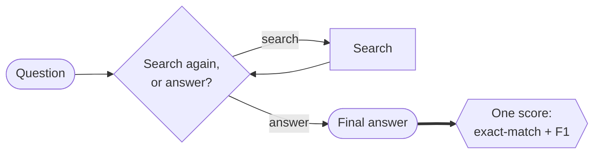
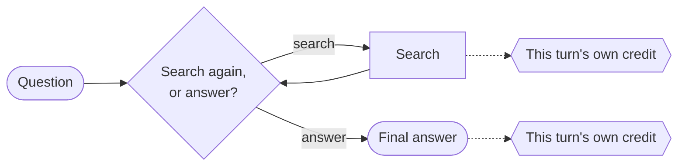
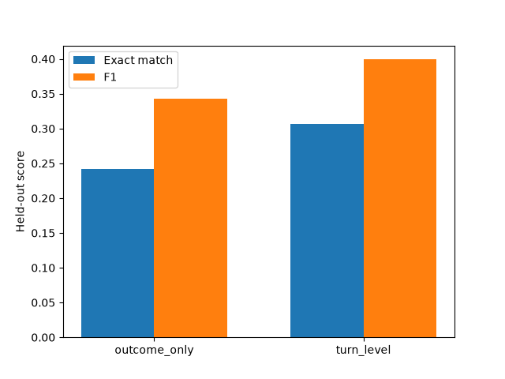
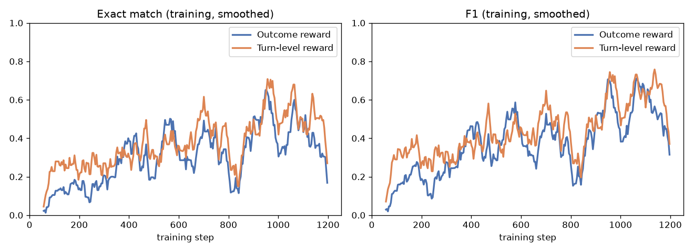
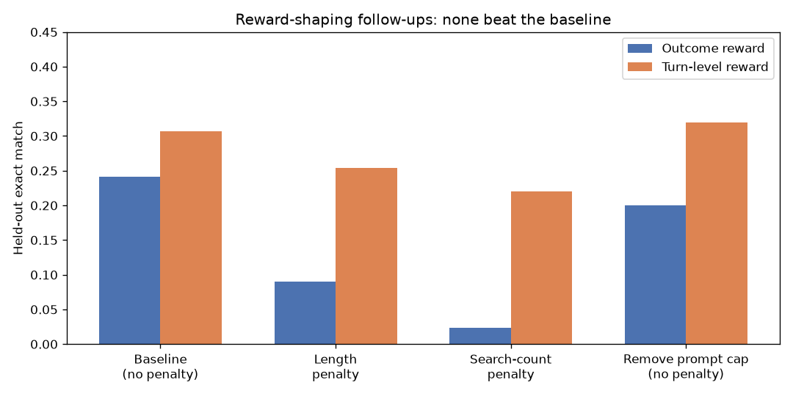

# Outcome vs. Turn-Level Reward for Multi-Turn Search Agents

**Goal**: determine whether rewarding an AI agent's intermediate actions — not just its final
answer — produces a measurably better multi-turn search agent.

Inspired by ["Reinforcing Multi-Turn Reasoning in LLM Agents via Turn-Level Reward
Design"](https://arxiv.org/abs/2505.11821) (arXiv:2505.11821), specifically its GRPO case study
(`GRPO-OR` vs. `GRPO-MR`) — not a strict reproduction. Biggest differences: a much smaller model
(`Qwen3.5-0.8B` vs. the paper's `Qwen2.5-7B`), a different dataset (HotpotQA vs. TriviaQA), and a
softer search-turn cap (2 vs. their hard 1). Smaller deviations are noted inline below.

## What this compares

Same agent, same decision loop — at each turn it decides for itself whether to search again or
answer. Four reward methodologies from the paper, in increasing order of sophistication. This
repo implements the first two:

- **`GRPO-OR` — outcome only.** One score, from the final answer alone. **Implemented** (this
  repo's `outcome_only`).
- **`GRPO-MR` — merged reward.** The same final-answer score, *plus* a bonus for good search
  behavior — but both are summed into one combined number per attempt, still one score in, one
  score out (the paper calls this general approach "naive"). **Implemented** (this repo's
  `turn_level`).
- **`MT-GRPO` — turn-level credit assignment for GRPO.** Each turn gets its *own*, separately
  estimated credit instead of folding into one number, via extra rollouts per turn. **Out of
  scope** — exponentially expensive, and the training library this repo uses has no hook for it.
- **`MT-PPO` — turn-level credit assignment for PPO.** Same idea, via PPO's critic instead of
  extra rollouts — the paper's best-performing method. **Planned, not yet built** (see Roadmap).

**`GRPO-OR`:**



**`GRPO-MR` (this repo's `turn_level`):**


**Turn-level credit assignment (`MT-GRPO`, out of scope; `MT-PPO`, planned):**



This repo implements the first two under GRPO (`GRPO-OR`/`GRPO-MR`) — both complete, see Results
below. The same two reward methodologies under PPO (`PPO-OR`/`PPO-MR`) are designed but not yet
run — see Roadmap.

## Results

**Status: the GRPO comparison below (outcome reward vs. turn-level reward, Results 1–4) is
complete.** The PPO comparison described above has a finished design but hasn't been run yet —
see Roadmap. Everything below is GRPO-only.

**Key learnings, before the detail:**
1. Turn-level reward genuinely wins — confirmed across two independent runs (Result 2).
2. GRPO is more fragile to careless reward-shaping than it looks going in: with no value function
   to fall back on, a whole batch of attempts can share one blind spot and collapse together
   (Result 3).

### 1. What's actually being measured

The agent answers multi-hop trivia questions (from HotpotQA's validation split — 7,404 questions
neither reward condition ever trained on) by searching a real ~21M-passage Wikipedia snapshot and
producing a final answer. Three metrics track different things:

- **Exact match (EM)** — did the agent's final answer literally match an accepted answer string?
  Strict: "Barack Obama" ≠ "Obama."
- **F1** — word-overlap partial credit (the standard SQuAD-style scoring paper QA benchmarks use)
  for answers that are close but not verbatim.
- **Retrieval fraction** — of the real supporting-fact passages actually needed to answer the
  question, what fraction did the agent's searches surface? Only meaningful for turn-level reward,
  since that's the only condition whose reward depends on it.

### 2. Turn-level reward (`GRPO-MR`) wins



| Metric (held-out) | `GRPO-OR` / outcome reward | `GRPO-MR` / turn-level reward (naive*) |
|---|---|---|
| Exact match | 0.242 | **0.307** |
| F1 | 0.343 | **0.399** |
| Retrieval fraction | n/a | 0.528 |

*\*"naive" is the paper's own term for this mechanism: a reward bonus summed into one
trajectory-level scalar, scored by GRPO's standard advantage.*

Open question: under outcome-only reward, this agent searches *more* over training, not less —
surprising, since nothing in the reward rewards extra searching. Unexplained so far.

<details>
<summary>Is the EM/F1 win just favorable timing, or does it hold up throughout training?</summary>



Turn-level reward (orange) leads for most of training, not just at the final checkpoint — this
rules out "got lucky at the end" as the explanation. (Curves are a 15-point rolling average of
per-step training metrics; the raw values are noisy step-to-step, as GRPO reward inherently is —
smoothing is only for readability, not a different underlying result.)

This needed two attempts: a first, smaller run (300 steps) was too noisy — turn-level reward led
in training but reversed on held-out data. Doubling the budget and using a new seed resolved it,
with turn-level reward leading on both.
</details>

### 3. Three quick reward-shaping patches, tested against the working baseline above — all backfired

Three ad-hoc, uncalibrated attempts to improve on the baseline above (0.242 / 0.307 EM), each
tried in one session. **None worked** — but *how* they failed is the lesson:



- **Length penalty** (not from the paper — completions had grown 4x with no accuracy gain).
  Outcome reward **collapsed to 0.090 EM**, garbled text. Turn-level reward dropped to 0.254 EM,
  stayed coherent.
- **The paper's own PPO search-count penalty** (`R_search = -λ_s·n_search`, borrowed into GRPO —
  the GRPO ablation has no such term). Outcome reward **collapsed to 0.024 EM**, nonsense answers.
  Turn-level reward dropped to 0.221 EM — collapsed too, then *recovered* late in training.
- **Isolating control**: same prompt-guidance removal, *no* penalty. Outcome reward only dropped
  to 0.201 EM (searched *more*, not less). Turn-level reward rose to 0.320 EM — no cost. This
  pins the two collapses above on the penalty term itself, not the missing guidance.

**Why**: GRPO scores a group of attempts purely relative to each other, with no value function to
fall back on. If every attempt in a group finds the same cheap trick (stop searching, just guess),
GRPO can't see past it — the whole group looks equally bad. Turn-level reward's extra signal gave
the model something to hold onto instead; outcome reward's plainer signal didn't.

**Takeaway**: a bare penalty with no matching positive incentive is genuinely risky under GRPO —
more so than under an algorithm with a value function to catch a group sharing one mistake.

### 4. One more hypothesis, not yet confirmed

F1 partial credit (vs. the paper's binary exact-match) may be why this repro's outcome-only agent
kept learning instead of collapsing outright — worth testing deliberately in a follow-up.

## Roadmap

- **GRPO: outcome-only vs. merged-reward** — training and held-out evaluation complete for both
  conditions across two runs; the symmetric re-run shows a real, held-out-confirmed advantage for
  turn-level reward (see Results above). Three follow-up reward-design experiments are complete
  (see Results above); Phase 6 is fully done.
- **PPO: outcome-only vs. merged-reward** — design complete; not yet started.
- **LLM-as-judge reward** (an alternative to exact-match/F1 scoring, explored on top of the PPO
  comparison) — not yet started.

## Project structure

```
.
├── data/       # downloaded wiki-18 retrieval corpus + BM25 index (gitignored, multi-GB)
├── docs/       # phase docs, design specs, roadmap
├── outputs/    # training checkpoints + logs per condition (gitignored)
├── results/    # final held-out metrics + comparison plots (committed)
├── scripts/    # retrieval server, one-off setup/verification, compare_runs.py
├── src/        # the turn_level_rewards package (env, rewards, metrics, data, train, evaluate)
└── tests/      # unit tests (fast, no GPU, no live retrieval server)
```

## Getting started

### Prerequisites

- Python 3.13+
- [`uv`](https://docs.astral.sh/uv/)
- JDK 21 (needed by the retrieval server's Lucene bridge)

Two choices worth knowing before you set up: the model is a deliberately small `Qwen3.5-0.8B`
(fits one GPU, no distributed training), and retrieval hits a real ~21M-passage Wikipedia
snapshot rather than a small per-question pool (a closed pool would make retrieval trivially
easy to solve, not a real test).

```bash
uv sync
sudo apt install openjdk-21-jdk
```

### Retrieval server

Training and evaluation search a local BM25 server backed by the real wiki-18
Wikipedia dump (~21M passages). Set it up once:

```bash
bash scripts/setup_retrieval.sh   # downloads the wiki-18 BM25 index (+corpus if needed) into data/wiki18/
```

The script downloads the index, checks whether it also needs the separate
corpus file, and prints the exact command to launch the server — something
like:

```bash
uv run python scripts/retrieval_server.py \
    --index_path data/wiki18/bm25-repo/bm25 \
    --corpus_path data/wiki18/data00/jiajie_jin/flashrag_indexes/wiki_dpr_100w/wiki_dump.jsonl \
    --port 8000
```

Run that (in the background or a separate terminal — it needs to stay up for
the rest of setup and for training/evaluation later), then confirm it's
working:

```bash
uv run python scripts/verify_retrieval.py
```

```
PASS: retrieval server is up, wired correctly, and returns real documents.
```

### Training

```bash
uv run python -m turn_level_rewards.train --condition outcome_only
uv run python -m turn_level_rewards.train --condition turn_level
```

The bare invocation above (no extra flags) runs at smoke-test scale — 8 rows, 2 steps, a real
`Qwen/Qwen3.5-0.8B` model against the retrieval server started above. Pass `--train-size`,
`--max-steps`, `--num-generations`, etc. explicitly for a full-scale run. Both conditions
log to the same [trackio](https://github.com/gradio-app/trackio) project
(`turn-level-rewards`) — run `trackio show --project turn-level-rewards` to view.

## Contributing

See [`CONTRIBUTING.md`](CONTRIBUTING.md) for dev setup, quality gates, and running tests.
