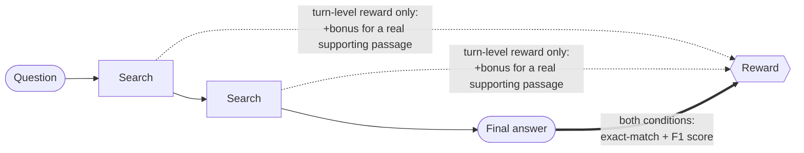

# Outcome vs. Turn-Level Reward for Multi-Turn Search Agents

**Goal**: determine whether rewarding an AI agent's intermediate actions — not just its final
answer — produces a measurably better multi-turn search agent, and whether that effect is real
or just training noise. "Real" means a specific bar: the effect has to hold up on data the model
never trained on, not just look good on the training curve, and it has to survive being checked
against a second, independent training run before being reported as a finding.

## What this compares

Same agent, same episode — the only thing that changes is *where* the reward attaches:



**Outcome reward** only ever scores the final answer — sparse, nothing to learn from until the
episode ends. **Turn-level reward** is the same scoring *plus* credit for good search behavior
along the way — denser, more to learn from earlier.

That comparison gets tested under two different RL algorithms, not just one — **GRPO** (ranks a
group of the agent's attempts at one question against each other) and **PPO** (learns a running
value estimate and nudges the policy toward actions that beat it, turn by turn). If turn-level
reward wins under both, that's a real finding about reward shaping, not an artifact of one
algorithm's mechanics.

Concretely, this is a simplified reproduction of two ablations from ["Reinforcing Multi-Turn
Reasoning in LLM Agents via Turn-Level Reward Design"](https://arxiv.org/abs/2505.11821)
(arXiv:2505.11821): its Appendix E GRPO case study (`GRPO-OR`/`GRPO-MR`), and its main-results PPO
comparison (`PPO`/`MT-PPO`).

## Key decisions & tradeoffs

| Decision | Why | Tradeoff |
|---|---|---|
| Real 21M-passage Wikipedia corpus, not a closed 10-paragraph pool | Closed pool = trivial retrieval, not a real test | Real setup cost (JDK, index, server) |
| `Qwen3.5-0.8B`, a small model | Fits one GPU, no distributed training | Lower accuracy ceiling than the paper's likely larger model |
| Search cap of 2, not the paper's 1 | HotpotQA is 2-hop; a 1-cap can't ever fully succeed | Deviates from the paper's exact setup |
| F1 + EM-bonus reward, not pure binary EM | Avoids zero-gradient rollout groups under GRPO | Deviates from the paper's reward — turned out to matter, see Result 4 |
| Re-ran at 2x budget, new seed, before trusting the result | First run's finding reversed on held-out data | 2x GPU cost before reporting anything |
| Added an isolating-control experiment after a fix backfired | Needed to separate cause from correlation | One more full training cycle |
| `MT-GRPO` (paper's own sharper per-turn credit assignment) — skipped | No supported hook in TRL for a custom per-turn advantage | Tests `GRPO-OR`/`GRPO-MR` only, not the full method |

## Results

**Status: the GRPO comparison below (outcome reward vs. turn-level reward, Results 1–4) is
complete.** The PPO comparison described above has a finished design but hasn't been run yet —
see Roadmap. Everything below is GRPO-only.

**Key learnings, before the detail:**
1. Turn-level reward genuinely wins — and only *after* it survived a second independent run was
   that trustworthy enough to report (Result 2).
2. GRPO is more fragile to careless reward-shaping than it looks going in: with no value function
   to fall back on, a whole batch of attempts can share one blind spot and collapse together
   (Result 3).
3. A reward-design choice made for an unrelated reason (avoiding zero-gradient groups) plausibly
   explains why this repro's simplest agent learned anything at all, where the paper's own
   version of it didn't (Result 4).

### 1. What's actually being measured

The agent answers multi-hop trivia questions (from HotpotQA's validation split — 7,404 questions
neither reward condition ever trained on) by searching a real ~21M-passage Wikipedia snapshot and
producing a final answer. Three metrics track different things:

- **Exact match (EM)** — did the agent's final answer literally match an accepted answer string?
  Strict: "Barack Obama" ≠ "Obama."
- **F1** — word-overlap partial credit (the standard SQuAD-style scoring paper QA benchmarks use)
  for answers that are close but not verbatim.
- **Retrieval fraction** — of the real supporting-fact passages actually needed to answer the
  question, what fraction did the agent's searches surface? Only meaningful for turn-level reward,
  since that's the only condition whose reward depends on it.

### 2. Turn-level reward wins — consistent with the source paper's direction, smaller in magnitude


| Metric (held-out) | Outcome reward | Turn-level reward | Source paper's `GRPO-OR` / `GRPO-MR` (Table 2) |
|---|---|---|---|
| Exact match | 0.242 | **0.307** | 0.0 / **0.335** |
| F1 | 0.343 | **0.399** | not reported |
| Retrieval fraction | n/a | 0.528 | not reported |

**Consistent**: turn-level reward wins in both, same direction as the paper. **Deviates in two
ways**: our numbers are lower and closer together (smaller model, less data — expected), and
outcome reward here didn't fully collapse to 0.0 like the paper's did (likely the F1-bonus reward
choice — see Result 4). One thing that didn't reproduce at all: the paper says outcome reward
gradually *stops* searching over training; here it searches *more* over time — an open, unexplained
discrepancy.

<details>
<summary>Is the EM/F1 win just favorable timing, or does it hold up throughout training?</summary>


Turn-level reward (orange) leads for most of training, not just at the final checkpoint — this
rules out "got lucky at the end" as the explanation. (Curves are a 15-point rolling average of
per-step training metrics; the raw values are noisy step-to-step, as GRPO reward inherently is —
smoothing is only for readability, not a different underlying result.)

One methodological note for the curious: this result needed two attempts. A first, smaller run
(300 steps) came back too noisy to trust — turn-level reward looked ahead during training but that
reversed on held-out data. Doubling the training budget and re-running with a different seed
resolved it, with turn-level reward leading on both training *and* held-out data. Full numbers for
both runs are in `docs/phase-6-evaluation-comparison.md`.
</details>

### 3. Three quick reward-shaping patches, tested against the working baseline above — all backfired

*("Quick" = first-pass, uncalibrated patches made in one session — not a claim about
`turn_level`/`GRPO-MR` itself. That naive-vs-sophisticated distinction is the paper's own, for
`GRPO-MR` vs. its `MT-GRPO`, which this repo doesn't attempt.)*

Three attempts to improve on the baseline (0.242 / 0.307 EM). **None worked** — but *how* they
failed is the lesson:


- **Length penalty** (not from the paper — completions had grown 4x with no accuracy gain).
  Outcome reward **collapsed to 0.090 EM**, garbled text. Turn-level reward dropped to 0.254 EM,
  stayed coherent.
- **The paper's own PPO search-count penalty** (`R_search = -λ_s·n_search`, borrowed into GRPO —
  the GRPO ablation has no such term). Outcome reward **collapsed to 0.024 EM**, nonsense answers.
  Turn-level reward dropped to 0.221 EM — collapsed too, then *recovered* late in training.
- **Isolating control**: same prompt-guidance removal, *no* penalty. Outcome reward only dropped
  to 0.201 EM (searched *more*, not less). Turn-level reward rose to 0.320 EM — no cost. This
  pins the two collapses above on the penalty term itself, not the missing guidance.

**Why**: GRPO scores a group of attempts purely relative to each other, with no value function to
fall back on. If every attempt in a group finds the same cheap trick (stop searching, just guess),
GRPO can't see past it — the whole group looks equally bad. Turn-level reward's extra signal gave
the model something to hold onto instead; outcome reward's plainer signal didn't.

**Takeaway**: a bare penalty with no matching positive incentive is genuinely risky under GRPO —
more so than under an algorithm with a value function to catch a group sharing one mistake.

Full numbers and example collapsed completions: `docs/phase-6-evaluation-comparison.md`.

### 4. What this adds beyond reproducing the paper

- **The isolating control itself.** The paper never separates "penalty term" from "missing
  guidance" as two causes — this repo's fourth configuration does, turning a guess into a specific
  finding.
- **A mechanism, not just a result.** *Why* GRPO is more fragile to bare penalties than PPO — no
  value function, so a whole group can share one blind spot — came from reading the model's actual
  collapsed completions, not from theory.
- **The F1-bonus reward choice, reframed.** Plausibly not just "what we used instead" but *why*
  this repro's outcome-only agent learned anything at all, where the paper's binary-reward version
  scored 0.0 — a transferable point for GRPO at small scale.

## Roadmap

- **GRPO: outcome-only vs. merged-reward** — training and held-out evaluation complete for both
  conditions across two runs; the symmetric re-run shows a real, held-out-confirmed advantage for
  turn-level reward (see Results above). Three follow-up reward-design experiments are complete
  (see Results above); Phase 6 is fully done.
- **PPO: outcome-only vs. merged-reward** — design complete; not yet started.
- **LLM-as-judge reward** (an alternative to exact-match/F1 scoring, explored on top of the PPO
  comparison) — not yet started.

## Project structure

```
data/       # downloaded wiki-18 retrieval corpus + BM25 index (gitignored, multi-GB)
docs/       # phase docs, design specs, roadmap
outputs/    # training checkpoints + logs per condition (gitignored)
results/    # final held-out metrics + comparison plots (committed)
scripts/    # retrieval server, one-off setup/verification, compare_runs.py
src/        # the turn_level_rewards package (env, rewards, metrics, data, train, evaluate)
tests/      # unit tests (fast, no GPU, no live retrieval server)
```

## Reproducing this

### Prerequisites

- Python 3.13+
- [`uv`](https://docs.astral.sh/uv/)
- JDK 21 (needed by the retrieval server's Lucene bridge)

```bash
uv sync
sudo apt install openjdk-21-jdk
```

### Retrieval server

Training and evaluation search a local BM25 server backed by the real wiki-18
Wikipedia dump (~21M passages). Set it up once:

```bash
bash scripts/setup_retrieval.sh   # downloads the wiki-18 BM25 index (+corpus if needed) into data/wiki18/
```

The script downloads the index, checks whether it also needs the separate
corpus file, and prints the exact command to launch the server — something
like:

```bash
uv run python scripts/retrieval_server.py \
    --index_path data/wiki18/bm25-repo/bm25 \
    --corpus_path data/wiki18/data00/jiajie_jin/flashrag_indexes/wiki_dpr_100w/wiki_dump.jsonl \
    --port 8000
```

Run that (in the background or a separate terminal — it needs to stay up for
the rest of setup and for training/evaluation later), then confirm it's
working:

```bash
uv run python scripts/verify_retrieval.py
```

```
PASS: retrieval server is up, wired correctly, and returns real documents.
```

### Training

```bash
uv run python -m turn_level_rewards.train --condition outcome_only
uv run python -m turn_level_rewards.train --condition turn_level
```

The bare invocation above (no extra flags) runs at smoke-test scale — 8 rows, 2 steps, a real
`Qwen/Qwen3.5-0.8B` model against the retrieval server started above. Pass `--train-size`,
`--max-steps`, `--num-generations`, etc. explicitly for a full-scale run. Both conditions
log to the same [trackio](https://github.com/gradio-app/trackio) project
(`turn-level-rewards`) — run `trackio show --project turn-level-rewards` to view.

## Contributing

See [`CONTRIBUTING.md`](CONTRIBUTING.md) for dev setup, quality gates, and running tests.
