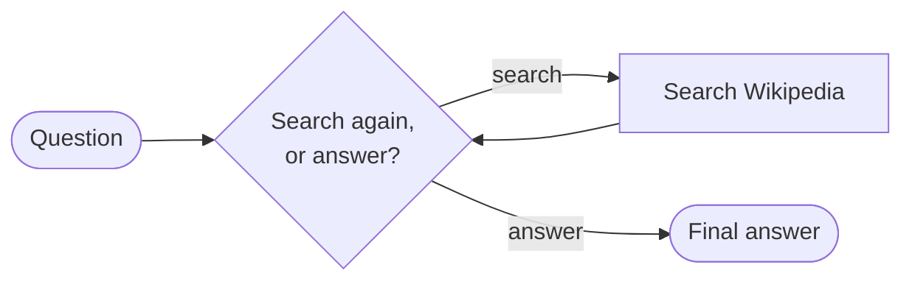
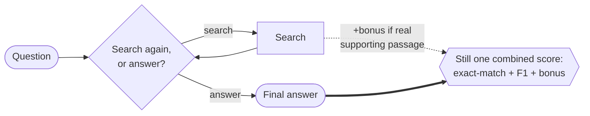
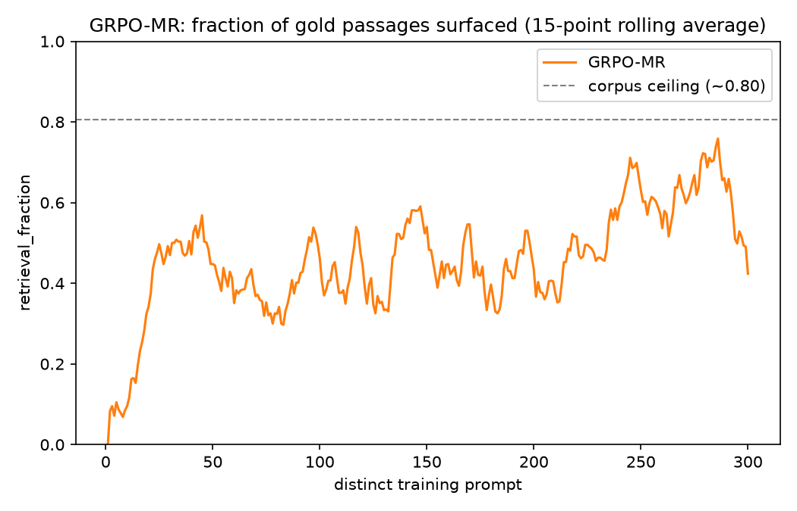
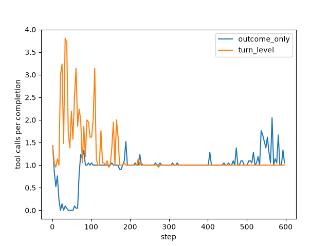

# Outcome vs. Turn-Level Reward for Multi-Turn Search Agents

**Goal**: determine whether rewarding an AI agent's intermediate actions — not just its final
answer — produces a measurably better multi-turn search agent.

**Why this matters.** RL algorithms like GRPO and PPO are the standard way to train multi-turn LLM
agents, but they're usually trained on sparse outcome rewards — one number, right or wrong, at the
very end of a long trajectory. That gives the agent no signal about which of its intermediate
actions (like a good search) actually helped. The paper this repo is inspired by found that adding
a dense, turn-level reward signal on top of the same algorithms fixes that: more stable training,
faster convergence, and higher accuracy than sparse-reward baselines. This repo tests whether that
holds up at a much smaller scale.

Inspired by ["Reinforcing Multi-Turn Reasoning in LLM Agents via Turn-Level Reward
Design"](https://arxiv.org/abs/2505.11821) (arXiv:2505.11821), specifically its GRPO and PPO case study
 — not a strict reproduction. Biggest differences: a much smaller model on a single consumer GPU
(`Qwen3.5-0.8B` on an RTX 4090, vs. the paper's `Qwen2.5-7B`) and a different dataset (HotpotQA
vs. TriviaQA). Smaller deviations are noted inline below.

## The agent

This repo's agent answers a question by deciding, at each turn, whether to search Wikipedia for
more information or give a final answer — so different rollouts of the same question can end up
searching a different number of times. Every condition below trains that identical agent and
decision loop; only the reward function changes, so any difference in results comes from the
reward design, not the architecture.



## Reward approaches explored

GRPO's baseline design can't use an intermediate signal even if you hand it one: it computes one
advantage per trajectory (Eq. 4 in the paper) and applies that identical value to every token in
every turn. A sharp search followed by a garbled answer, and a lazy search followed by a lucky
guess get scored no differently turn-by-turn — GRPO can't isolate which turn actually earned the
credit. That's true no matter *where* in the trajectory you attach a bonus reward — GRPO only
ever sees one number per trajectory, so a bonus placed mid-episode still just gets folded into
that same number by the time training sees it. Actually using *where* a reward happened requires
a critic that can evaluate any point in a trajectory on its own — which is what PPO has and GRPO
doesn't, and why the last two approaches below switch algorithms instead of just rearranging the
reward within GRPO.

This repo compares four ways to address it, in increasing order of how directly they solve it:

- **`GRPO-OR` — outcome only.** Reward = final-answer correctness, nothing else. Simplest
  baseline; search behavior gets no direct training signal at all. **Implemented**
- **`GRPO-MR` — merged reward** (the paper's own term for this approach is "naive"). Adds a bonus
  for good search behavior — but folds it into the *same* one trajectory-level number GRPO already
  scores. Denser reward, but the advantage is still spread uniformly across every token; GRPO still
  can't tell which turn helped. **Implemented**
- **`PPO-OR` — the same outcome-only reward as `GRPO-OR`, scored by a critic instead.** Same
  reward, different algorithm: no group comparison, just a learned value function estimating
  expected return. This repo's baseline for the comparison below. **Coming soon**
- **`MT-PPO` — turn-level reward with a critic, not extra rollouts.** Same setup as `PPO-OR`, but
  adds a bonus for good search behavior and places it at the turn it was earned instead of dumping
  it at the end — PPO's critic already estimates value token-by-token (GAE), so credit flows
  backward through the trajectory automatically. No exponential rollout cost, no fixed-turn
  requirement. The paper's best-performing method. **Coming soon**

### Outcome Only Reward (GRPO-OR)


### Merged Reward (GRPO-MR)



### Outcome Only Reward, with a Critic (PPO-OR)


### Turn-Level Credit Assignment (MT-PPO)


## Results

*(GRPO only — PPO coming soon)*

### What's being measured

Both reward approaches above — outcome-only reward (`GRPO-OR`) and merged reward (`GRPO-MR`) —
were trained on HotpotQA and evaluated on a 7,404-question held-out test set neither one ever
trained on, using three metrics that track different things:

- **Exact match (EM)** — did the agent's final answer literally match an accepted answer string?
  Strict: "Barack Obama" ≠ "Obama."
- **F1** — the standard SQuAD-style score QA benchmarks use: the harmonic mean of word-level
  precision and recall between the predicted and gold answer, giving partial credit for answers
  that are close but not verbatim.
- **Retrieval fraction** — of the real supporting-fact passages actually needed to answer the
  question, what fraction did the agent's searches surface? Only tracked for merged reward, since
  that's the only condition whose reward depends on it.

### 1. Merged reward (`GRPO-MR`) outperforms outcome-only reward (`GRPO-OR`)


| Metric (held-out) | `GRPO-OR` / outcome reward | `GRPO-MR` / merged reward (naive*) |
|---|---|---|
| Exact match | 0.242 | **0.307** |
| F1 | 0.343 | **0.399** |

*\*"naive" is the paper's own term for this mechanism: a reward bonus summed into one
trajectory-level scalar, scored by GRPO's standard advantage.*

`GRPO-OR` has no retrieval_fraction to compare against — its reward never looks at search
quality — so the only meaningful comparison for `GRPO-MR`'s retrieval_fraction is against itself
over time. It climbed steadily over training, closing in on the corpus's own ~80% ceiling (about
20% of HotpotQA's gold passage titles simply aren't in this repo's Wikipedia snapshot, so even
perfect retrieval can't reach 1.0):



Search behavior tells its own story too, and it's still unexplained: under outcome-only reward,
this agent searches *more* over training, not less — surprising, since nothing in the reward
rewards extra searching.



<details>
<summary>Why did this need a second run — and why is that not just seed-shopping?</summary>

Before ever launching a training run, four objective checks were written down for deciding
whether a result could just be noise: is the gap between conditions smaller than the run's own
step-to-step swings; does the held-out result contradict the training-time trend; does the
paper's claimed search-frequency mechanism actually show up; does retrieval_fraction keep
declining instead of stabilizing. These were fixed in advance, not chosen after seeing a result
that didn't look right.

The first run (300 steps, 150 distinct training prompts) tripped 3 of the 4. The most damning:
merged reward led throughout training, but held-out data flipped it entirely — `GRPO-OR` ahead,
0.2355 vs. 0.2068 EM. That's a real, quantified reliability failure, not a hunch.

The fix was **one** pre-planned replication at double the training data (300 distinct prompts
instead of 150), run identically for both conditions — not several seeds tried until one gave
the preferred answer. A new seed was necessary only because re-running the same seed on this
deterministic pipeline reproduces the same run, not an independent data point; the actual fix is
the added training data, not the seed itself.


The replication resolved cleanly: merged reward now leads on both training and held-out data
(the curves above), and re-checking all four criteria against the new numbers, only one still
triggers — the search-call-frequency anomaly already shown above (`GRPO-OR` searching more, not
less, over training).
(Curves are a 15-point rolling average of per-step training metrics; the raw values are noisy
step-to-step, as GRPO reward inherently is — smoothing is only for readability, not a different
underlying result.)
</details>

### 2. Three quick reward-shaping patches, tested against the working baseline above — all backfired

Three ad-hoc, uncalibrated attempts to improve on the baseline above (0.242 / 0.307 EM), each
tried in one session. **None worked** — but *how* they failed is the lesson:


- **Length penalty** (not from the paper — completions had grown 4x with no accuracy gain).
  Outcome reward **collapsed to 0.090 EM**, garbled text. Merged reward dropped to 0.254 EM,
  stayed coherent.
- **The paper's own PPO search-count penalty** (`R_search = -λ_s·n_search`, borrowed into GRPO —
  the GRPO ablation has no such term). Outcome reward **collapsed to 0.024 EM**, nonsense answers.
  Merged reward dropped to 0.221 EM — collapsed too, then *recovered* late in training.
- **Isolating control**: same prompt-guidance removal, *no* penalty. Outcome reward only dropped
  to 0.201 EM (searched *more*, not less). Merged reward rose to 0.320 EM — no cost. This
  pins the two collapses above on the penalty term itself, not the missing guidance.

**Why**: GRPO scores a group of attempts purely relative to each other, with no value function to
fall back on. If every attempt in a group finds the same cheap trick (stop searching, just guess),
GRPO can't see past it — the whole group looks equally bad. Merged reward's extra signal gave
the model something to hold onto instead; outcome reward's plainer signal didn't.

**Takeaway**: a bare penalty with no matching positive incentive is genuinely risky under GRPO —
more so than under an algorithm with a value function to catch a group sharing one mistake.

### 3. We spotted a shortcoming in the paper's approach, and adapted around it

The paper's own outcome-only baseline (binary exact-match, no partial credit) collapsed to 0.0 in
its GRPO case study. We caught why before ever training a single step: GRPO has no critic to fall
back on, so a group where every rollout scores identically — plausible early in training, when
nothing's right yet — gives it zero gradient to learn from. So this repo's outcome-only reward
uses F1 partial credit instead: even when nobody in a group is exactly right, F1 still gives the
group non-identical scores to differentiate by. This repro's outcome-only agent did keep learning
rather than collapsing — consistent with the adaptation working, though we haven't run a
binary-EM-only ablation on
our own setup to confirm F1 is actually why.

### Key learnings

1. Merged reward (`GRPO-MR`) outperforms outcome-only reward (`GRPO-OR`) on our held-out test set
   (Result 1).
2. A bare penalty with no matching positive incentive fully and permanently collapsed `GRPO-OR`'s
   policy. `GRPO-MR` was far more resilient to the same penalties, though not fully immune
   (Result 2).
3. We identified why the paper's own outcome-only baseline collapsed to 0.0 (GRPO has no critic,
   so zero-gradient rollout groups give it nothing to learn from) and designed this repo's reward
   to avoid that failure mode — our outcome-only condition never collapsed (Result 3).

## Roadmap

- **GRPO: outcome-only vs. merged-reward** — training and held-out evaluation complete for both
  conditions across two runs; the symmetric re-run shows a real, held-out-confirmed advantage for
  merged reward (see Results above). Three follow-up reward-design experiments are complete
  (see Results above); Phase 6 is fully done.
- **PPO: outcome-only vs. merged-reward** — design complete; not yet started.
- **LLM-as-judge reward** — the paper studies two kinds of turn-level reward: *verifiable* (this
  repo's `turn_reward`, an objective check on whether a real supporting passage got surfaced) and
  *LLM-as-judge* (a model scores the turn instead). The judge variant, explored on top of the PPO
  comparison — not yet started.

## Project structure

```
.
├── data/       # downloaded wiki-18 retrieval corpus + BM25 index (gitignored, multi-GB)
├── docs/       # phase docs, design specs, roadmap
├── outputs/    # training checkpoints + logs per condition (gitignored)
├── results/    # final held-out metrics + comparison plots (committed)
├── scripts/    # retrieval server, one-off setup/verification, compare_runs.py
├── src/        # the turn_level_rewards package (env, rewards, metrics, data, train, evaluate)
└── tests/      # unit tests (fast, no GPU, no live retrieval server)
```

## Getting started

### Prerequisites

- Python 3.13+
- [`uv`](https://docs.astral.sh/uv/)
- JDK 21 (needed by the retrieval server's Lucene bridge)

Two choices worth knowing before you set up: the model is a deliberately small `Qwen3.5-0.8B`
(fits one GPU, no distributed training), and retrieval hits a real ~21M-passage Wikipedia
snapshot rather than a small per-question pool (a closed pool would make retrieval trivially
easy to solve, not a real test).

```bash
uv sync
sudo apt install openjdk-21-jdk
```

### Retrieval server

Training and evaluation search a local BM25 server backed by the real wiki-18
Wikipedia dump (~21M passages). Set it up once:

```bash
bash scripts/setup_retrieval.sh   # downloads the wiki-18 BM25 index (+corpus if needed) into data/wiki18/
```

The script downloads the index, checks whether it also needs the separate
corpus file, and prints the exact command to launch the server — something
like:

```bash
uv run python scripts/retrieval_server.py \
    --index_path data/wiki18/bm25-repo/bm25 \
    --corpus_path data/wiki18/data00/jiajie_jin/flashrag_indexes/wiki_dpr_100w/wiki_dump.jsonl \
    --port 8000
```

Run that (in the background or a separate terminal — it needs to stay up for
the rest of setup and for training/evaluation later), then confirm it's
working:

```bash
uv run python scripts/verify_retrieval.py
```

```
PASS: retrieval server is up, wired correctly, and returns real documents.
```

### Training

```bash
uv run python -m turn_level_rewards.train --condition outcome_only
uv run python -m turn_level_rewards.train --condition turn_level
```

The bare invocation above (no extra flags) runs at smoke-test scale — 8 rows, 2 steps, a real
`Qwen/Qwen3.5-0.8B` model against the retrieval server started above. Pass `--train-size`,
`--max-steps`, `--num-generations`, etc. explicitly for a full-scale run. Both conditions
log to the same [trackio](https://github.com/gradio-app/trackio) project
(`turn-level-rewards`) — run `trackio show --project turn-level-rewards` to view.

## Contributing

See [`CONTRIBUTING.md`](CONTRIBUTING.md) for dev setup, quality gates, and running tests.
